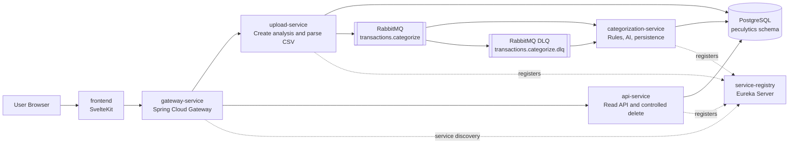
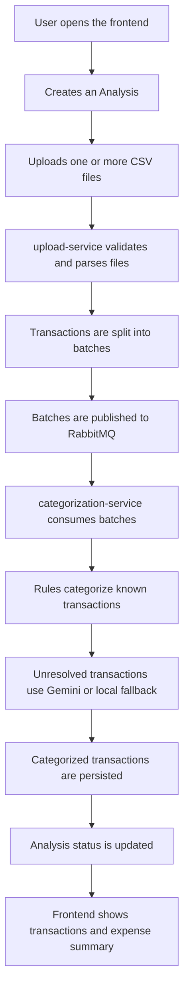
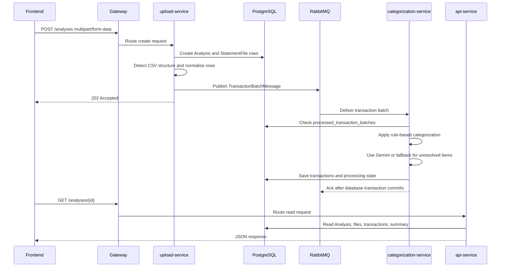
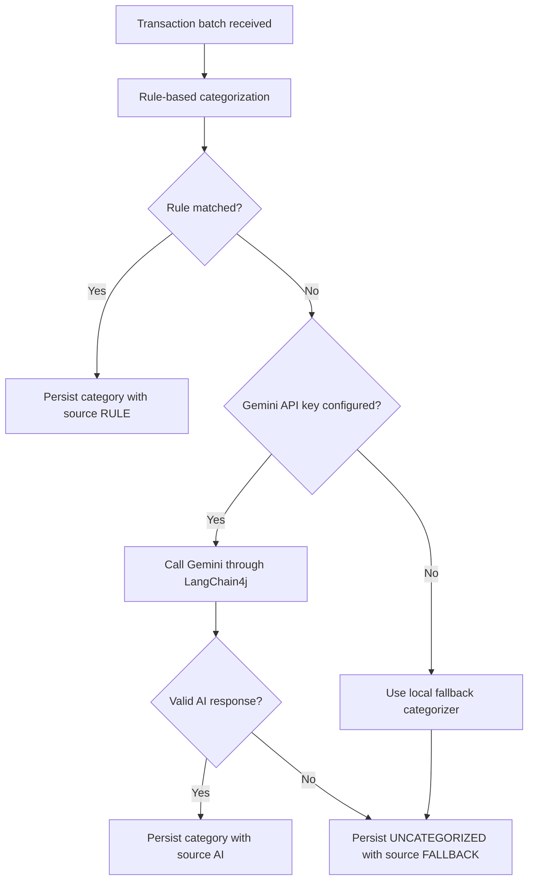

# Peculytics

Peculytics is an AI-assisted financial analysis system that processes CSV bank
statements asynchronously using a microservices architecture.

Users create an Analysis, upload one or more CSV bank statement files, and the
system processes those files in the background. Transactions are normalized,
split into batches, published through RabbitMQ, categorized by rules and AI
fallback logic, persisted in PostgreSQL, and exposed to a SvelteKit frontend
through a Spring Cloud Gateway.

The user flow is deliberately focused, but the system is fully runnable: it
accepts uploads, processes transactions in the background, handles failure
paths, and exposes the result through a working frontend. The architecture puts
most of the attention on service boundaries, messaging contracts, failure
handling, idempotency, and local orchestration with Docker Compose.

## Table of Contents

- [Core capabilities](#core-capabilities)
- [Tech Stack](#tech-stack)
- [Architecture Overview](#architecture-overview)
- [Main User Flow](#main-user-flow)
- [Asynchronous Processing Sequence](#asynchronous-processing-sequence)
- [Services](#services)
- [Data Ownership](#data-ownership)
- [RabbitMQ Contract](#rabbitmq-contract)
- [Categorization Strategy](#categorization-strategy)
- [CSV Parsing](#csv-parsing)
- [API Overview](#api-overview)
- [Local Setup](#local-setup)
- [Environment Variables](#environment-variables)
- [Repository Structure](#repository-structure)
- [Current Limitations](#current-limitations)

## Core capabilities

- Microservices with independent Spring Boot applications
- Service discovery with Eureka
- API routing with Spring Cloud Gateway
- Asynchronous transaction processing with RabbitMQ
- Dead Letter Queue handling for failed categorization messages
- Idempotent batch consumption
- PostgreSQL schema migrations with Flyway
- CSV parsing for multiple bank-like formats
- Rule-based categorization before AI usage
- LangChain4j integration with Gemini
- Local AI fallback when no Gemini API key is configured
- SvelteKit frontend consuming only the Gateway API
- Contract tests for RabbitMQ payload compatibility
- Unit tests for parsing, categorization, API behavior, and processing rules

## Tech Stack

| Area | Technology |
| --- | --- |
| Backend | Java 21, Spring Boot, Spring Data JPA |
| Microservices | Spring Cloud Gateway, Eureka |
| Messaging | RabbitMQ |
| Database | PostgreSQL, Flyway |
| AI integration | LangChain4j, Gemini |
| Frontend | SvelteKit, Tailwind CSS, TypeScript |
| Local environment | Docker Compose |
| Testing | JUnit, Mockito, Maven, svelte-check |

## Architecture Overview



### Why Microservices?

The system has two different kinds of work: request/response operations and
background processing. Uploading a CSV should return quickly, while
categorization can take longer because it may involve many rows, batching,
RabbitMQ retries, and an external AI provider. Splitting these responsibilities
keeps the upload path from being tied to the categorization runtime.

The service split follows the way I wanted the system to behave:

- `upload-service` owns ingestion: create analyses, receive files, parse CSV,
  and publish transaction batches.
- `categorization-service` owns asynchronous processing: consume batches,
  categorize transactions, persist results, update processing state, and handle
  DLQ messages.
- `api-service` owns read-oriented APIs for the frontend, with one explicit
  write exception: deleting a non-processing Analysis.
- `gateway-service` is the single HTTP entry point used by the frontend.
- `service-registry` provides service discovery for internal routing.

This is more infrastructure than a simple CRUD application needs, but it fits
the problem being solved. The upload flow, the categorization worker, and the
read API have different reasons to change and different failure modes. Keeping
them separate makes those boundaries visible in the code instead of hiding them
behind one large application.

### Why Eureka?

The services run together in Docker Compose, so they could call each other by
container name. I still chose Eureka because the Gateway should route to logical
service names instead of hard-coded host and port combinations.

For example, the Gateway routes to:

```text
lb://upload-service
lb://api-service
```

That keeps the Gateway configuration closer to how a service-discovery based
system is normally wired. It also makes the service registry visible as part of
the architecture: services start, register themselves, and the Gateway resolves
them through discovery.

In a local project this may look like extra setup, but it is not decorative. It
shows a real microservice concern: callers should depend on service identity,
not on a specific machine address.

### Why RabbitMQ?

RabbitMQ is the center of the processing flow because upload and
categorization should not run as one synchronous operation.

When the user uploads a statement, the system can validate the request, create
the Analysis, parse valid CSV rows, publish batches, and return `202 Accepted`.
The slower part then happens in the background. This matters because
categorization may involve many transactions and, when a Gemini API key is
configured, network calls to an external AI provider.

RabbitMQ also gives the system explicit failure behavior:

- batches are processed independently;
- a failed batch does not block already published batches;
- retry attempts are configured in the consumer;
- exhausted messages move to `transactions.categorize.dlq`;
- duplicate batch processing is guarded by `processed_transaction_batches`.

This is why the queue is part of the design, not just an implementation detail.
The message boundary is what separates ingestion from processing.

### Why LangChain4j?

The categorization service does not call Gemini directly through hand-written
HTTP code. It uses LangChain4j behind a small application interface:

```text
TransactionCategorizerAi
```

That keeps provider-specific code away from the business flow. The service can
build a categorization prompt, call the model, validate the response, and fall
back safely when the model is unavailable or returns invalid output.

This design also makes local development easier. If `GEMINI_API_KEY` is empty,
Spring wires a local fallback implementation instead of the Gemini-backed
implementation. The rest of the processing pipeline stays the same: batches are
consumed, rule-based categorization still runs, unresolved transactions are
stored as `UNCATEGORIZED / FALLBACK`, and the Analysis can still complete.

## Main User Flow



## Asynchronous Processing Sequence



## Services

| Service | Port | Responsibility |
| --- | ---: | --- |
| `frontend` | 5173 | User interface for creating and viewing analyses |
| `gateway-service` | 8080 | Single HTTP entry point and route mapping |
| `service-registry` | 8761 | Eureka service discovery |
| `upload-service` | 8081 | File upload, CSV parsing, batch publishing |
| `categorization-service` | 8082 | Batch consumption, categorization, persistence, DLQ handling |
| `api-service` | 8083 | Analysis listing, detail, transactions, summary, controlled delete |
| `postgres` | 5432 | Local PostgreSQL database |
| `rabbitmq` | 5672 | RabbitMQ broker |
| `rabbitmq management` | 15672 | RabbitMQ management UI |

## Data Ownership

The services use one PostgreSQL database and one schema in the local
environment. That keeps Docker Compose manageable while still preserving clear
ownership rules at the table level.

| Table | Main owner | Access pattern |
| --- | --- | --- |
| `analyses` | `upload-service` creates, `categorization-service` updates status | `api-service` reads and may delete non-processing rows |
| `statement_files` | `upload-service` creates, `categorization-service` updates status | `api-service` reads |
| `transactions` | `categorization-service` writes | `api-service` reads |
| `categorization_rules` | Migration seed data | `categorization-service` reads |
| `processed_transaction_batches` | `categorization-service` | Idempotency table for consumed batches |

`api-service` is intentionally read-oriented. Its only write operation is
`DELETE /analyses/{id}`, and only for Analyses that are not `PROCESSING`.

## RabbitMQ Contract

The main queue is:

```text
transactions.categorize
```

The dead letter queue is:

```text
transactions.categorize.dlq
```

`upload-service` publishes transaction batches. `categorization-service`
consumes the same JSON payload.

Example payload:

```json
{
  "analysisId": "6e0b48a3-5d9a-4b4e-9dfb-1bc51b4f91a1",
  "statementFileId": "4df92d35-feb2-42c2-bb64-bb4eabcf25bc",
  "batchNumber": 1,
  "totalBatches": 3,
  "transactions": [
    {
      "description": "IFOOD RESTAURANT",
      "amount": -45.9,
      "transactionDate": "2026-03-15"
    }
  ]
}
```

Rules:

- A batch contains at most 50 transactions.
- Empty batches are never published.
- Each message includes `analysisId`, `statementFileId`, `batchNumber`, and
  `totalBatches`.
- The consumer acknowledges a message only after the database transaction
  commits.
- Duplicate batch processing is prevented with
  `(analysisId, statementFileId, batchNumber)`.

Retry and DLQ behavior:

| Setting | Value |
| --- | ---: |
| Total processing attempts | 3 |
| Spring retry setting | `max-retries: 2` |
| Retry delay | 5 seconds |
| DLQ | `transactions.categorize.dlq` |

The project includes contract tests to verify that the producer serialization
and consumer deserialization stay compatible.

## Categorization Strategy

Categorization happens in this order:



Rules always have priority over AI. If a transaction matches a rule, it is not
sent to Gemini.

When `GEMINI_API_KEY` is empty, the system uses a local fallback categorizer.
This is the supported local development mode and is not treated as a failure.

If Gemini fails, times out, or returns invalid data, unresolved transactions are
stored as:

```text
category = UNCATEGORIZED
categorySource = FALLBACK
```

## CSV Parsing

Peculytics is bank-agnostic. The parser detects CSV structure by looking at
headers, delimiters, date formats, amount formats, and debit or credit columns.

Supported examples include:

- Standard amount column: `date,description,amount`
- Brazilian typed amount columns: `Data Lancamento;Descricao;Valor;Tipo`
- Separate debit and credit columns
- Quoted semicolon-separated CSV files

Sample files are available in:

```text
samples/
```

Current samples:

| File | Purpose |
| --- | --- |
| `standard-amount.csv` | Basic date, description, amount format |
| `brazilian-typed-amount.csv` | Brazilian-style amount and transaction type |
| `debit-credit-columns.csv` | Separate debit and credit columns |
| `quoted-semicolon.csv` | Quoted semicolon-separated values |
| `multi-batch-mixed-rules.csv` | Larger file that generates multiple batches |
| `unsupported-missing-amount.csv` | Invalid sample for parser rejection behavior |

Invalid rows are ignored with warning logs. If a file has no valid transactions,
the related `StatementFile` is marked as `FAILED`.

## API Overview

The frontend calls only the Gateway:

```text
http://localhost:8080
```

| Method | Path | Routed to | Description |
| --- | --- | --- | --- |
| `POST` | `/analyses` | `upload-service` | Create an Analysis and upload CSV files |
| `GET` | `/analyses` | `api-service` | List Analyses ordered by creation date |
| `GET` | `/analyses/{id}` | `api-service` | Get Analysis details |
| `GET` | `/analyses/{id}/transactions` | `api-service` | Get paginated transactions |
| `GET` | `/analyses/{id}/summary` | `api-service` | Get expense summary grouped by category |
| `DELETE` | `/analyses/{id}` | `api-service` | Delete a non-processing Analysis |

Example upload request:

```bash
curl -X POST http://localhost:8080/analyses \
  -F "title=March 2026 Expenses" \
  -F "files=@samples/standard-amount.csv" \
  -F "files=@samples/debit-credit-columns.csv" \
  -F "fileTitles=Checking Account" \
  -F "fileTitles=Credit Card"
```

Example transaction request:

```bash
curl "http://localhost:8080/analyses/{analysisId}/transactions?page=0&size=50"
```

All API errors are returned as structured JSON using Spring `ProblemDetail`
where applicable. Stack traces are not exposed to users.

## Local Setup

### Requirements

- Docker and Docker Compose
- Java 21
- Maven 3.9+ if you want to run all backend tests from the backend root
- Node.js 24+ for local frontend commands outside Docker

### 1. Create a local environment file

PowerShell:

```powershell
Copy-Item .env.example .env
```

Bash:

```bash
cp .env.example .env
```

For local development without Gemini, leave `GEMINI_API_KEY` empty:

```env
GEMINI_API_KEY=
```

If you want to test real Gemini categorization, set:

```env
GEMINI_API_KEY=your_real_key
GEMINI_MODEL=gemini-flash-lite-latest
```

### 2. Start the full environment

```bash
docker compose up --build
```

*The first build may take a while because Docker builds each Spring Boot service
and the SvelteKit frontend.*

### 3. Open the application

| Target | URL |
| --- | --- |
| Frontend | `http://localhost:5173` |
| Gateway API | `http://localhost:8080` |
| Eureka dashboard | `http://localhost:8761` |
| RabbitMQ management | `http://localhost:15672` |

Default RabbitMQ credentials come from `.env`:

```text
guest / guest
```

### 4. Stop the environment

```bash
docker compose down
```

To also remove local database data:

```bash
docker compose down -v
```

## Environment Variables

| Variable | Required | Default/example | Notes |
| --- | --- | --- | --- |
| `POSTGRES_DB` | Yes | `peculytics` | Database name |
| `POSTGRES_USER` | Yes | `admin` | Local database user |
| `POSTGRES_PASSWORD` | Yes | `admin` | Local database password |
| `RABBITMQ_DEFAULT_USER` | Yes | `guest` | RabbitMQ user |
| `RABBITMQ_DEFAULT_PASS` | Yes | `guest` | RabbitMQ password |
| `GEMINI_API_KEY` | No | empty | Empty value enables local AI fallback |
| `GEMINI_MODEL` | No | `gemini-flash-lite-latest` | Used only when a Gemini key is configured |
| `PUBLIC_API_BASE_URL` | Yes | `http://localhost:8080` | Frontend API base URL |

## Repository Structure

```text
peculytics/
  backend/
    api-service/
    categorization-service/
    gateway-service/
    service-registry/
    upload-service/
    Dockerfile
    pom.xml
  frontend/
    src/
    Dockerfile
    package.json
  infra/
    migrations/
  samples/
  docker-compose.yaml
  peculytics-final-spec.md
  README.md
```
## Current Limitations

The first version focuses on the core flow: CSV upload, asynchronous processing,
transaction categorization, and analysis visualization. The items below are not
implemented because they are not required for that initial version.

They would be reasonable candidates for future updates, but they are not needed
to run or evaluate the current system:

- No authentication or multi-user support
- No manual transaction editing
- No manual recategorization
- No PDF or OFX import
- No export feature
- No full outbox or saga implementation

The most natural next steps would be support for more CSV formats, stronger
production-grade messaging guarantees, and richer categorization options.
